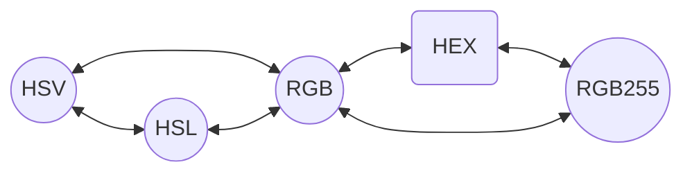

# Nix colorizer

Flake that helps adjust colors in different color models.

Representations of colors:

1. HEX - just string like `#FFFFFF`
2. RGB - rgb format where values are in [0; 1]
3. RGB255 - rgb format where values are in [0; 255] and are integer
4. HSV - hue are in [0; 360), saturation and value are in [0; 1]
5. HSL - hue are in [0; 360), saturation and lightness are in [0; 1]

You can one representation to another in this ways:


# Usage
Add `nix-colorizer` to flake inputs:
```nix
inputs.nix-colorizer.url = "github:nutsalhan87/nix-colorizer";
```

Then pass to `specialArgs` for NixOS configuration or to `extraSpecialArgs` for Home Manager configuration:
```nix
outputs = { nixpkgs, nix-colorizer, ... }: {
    nixosConfigurations = {
        # ...
      ass = nixpkgs.lib.nixosSystem {
        specialArgs = { inherit nix-colorizer; };
      };
    };

    homeConfigurations = {
      "we@can" = home-manager.lib.homeManagerConfiguration {
        # ...
        extraSpecialArgs = { inherit nix-colorizer; };
      };
    };
  };
```

You will have this attribute set structure^
```nix
nix-colorizer = {
    hex.to = {
      rgb255 = ...; # String -> { r, g, b } 
      rgb = ...; # String -> { r, g, b }
    };
    rgb255 = {
      clamp = ...; # { r, g, b } -> { r, g, b }
      to = {
        hex = ...; # { r, g, b } -> String
        rgb = ...; # { r, g, b } -> { r, g, b }
      };
      add = ...; # { r, g, b }@self, { r?, g?, b? }@adds -> { r, g, b }
      sub = ...; # { r, g, b }@self, { r?, g?, b? }@subs -> { r, g, b }
    };
    rgb = {
      clamp = ...; # { r, g, b } -> { r, g, b }
      to = {
        hex = ...; # { r, g, b } -> String
        rgb255 = ...; # { r, g, b } -> { r, g, b }
        hsv = ...; # { r, g, b } -> { h, s, v }
        hsl = ...; # { r, g, b } -> { h, s, l }
      };
      add = ...; # { r, g, b }@self, { r?, g?, b? }@adds -> { r, g, b }
      sub = ...; # { r, g, b }@self, { r?, g?, b? }@subs -> { r, g, b }
      mul = ...; # { r, g, b }@self, { r?, g?, b? }@muls -> { r, g, b }
      div = ...; # { r, g, b }@self, { r?, g?, b? }@divs -> { r, g, b }
    };
    hsv = {
      clamp = ...; # { h, s, v } -> { h, s, v }
      to = {
        hsl = ...; # { h, s, v } -> { h, s, l }
        rgb = ...; # { h, s, v } -> { r, g, b }
      };
      add = ...; # { h, s, v }@self, { h?, s?, v? }@adds -> { h, s, v }
      sub = ...; # { h, s, v }@self, { h?, s?, v? }@subs -> { h, s, v }
      mul = ...; # { h, s, v }@self, { s?, v? }@muls -> { h, s, v }
      div = ...; # { h, s, v }@self, { s?, v? }@divs -> { h, s, v }
    };
    hsl = {
      clamp = ...; # { h, s, l } -> { h, s, l }
      to = {
        hsv = ...; # { h, s, l } -> { h, s, v }
        rgb = ...; # { h, s, l } -> { r, g, b }
      };
      add = ...; # { h, s, l }@self, { h?, s?, l? }@adds -> { h, s, l }
      sub = ...; # { h, s, l }@self, { h?, s?, l? }@subs -> { h, s, l }
      mul = ...; # { h, s, l }@self, { s?, l? }@muls -> { h, s, l }
      div = ...; # { h, s, l }@self, { s?, l? }@divs -> { h, s, l }
    };
  };
```

## Some notes:

1. You can go beyond range of values while doing math operations.\
    To every module (except `hex`) has `clamp` function to limit color values. 
2. Clamping happening everytime you convert to hex (from rgb or rgb255).
3. The main different between `rgb` and `rgb255` is values range: the first one has [0; 1] and the second one have [0; 255]. Accordingly, `clamp` function works differently in this modules.\
    Another different is that `rgb255` have 4 operations but `rgb` only 2 - `add` and `sub`.
4. In HSV and HSL you can only use `add` and `sub` operations to adjust hue unlike saturation and value/lightness where you can use any operation.

## Example
Let's write function that will lighten hex color by percent value and get resulting hex string:
```nix
{
  lighten = hex: percent: let
    rgbValue = nix-colorizer.hex.to.rgb hex;
    hslValue = nix-colorizer.rgb.to.hsl rgbValue;
    modifier = 1 + percent / 100.0;
    lightened = nix-colorizer.hsl.mul hslValue { l = modifier; };
    lighenedRgbValue = nix-colorizer.hsl.to.rgb lightened;
  in
    nix-colorizer.rgb.to.hex lighenedRgbValue;
};
```

Demonstrating:
```
nix-repl> lighten "#AAAAAA" 20
"#CCCCCC"
```